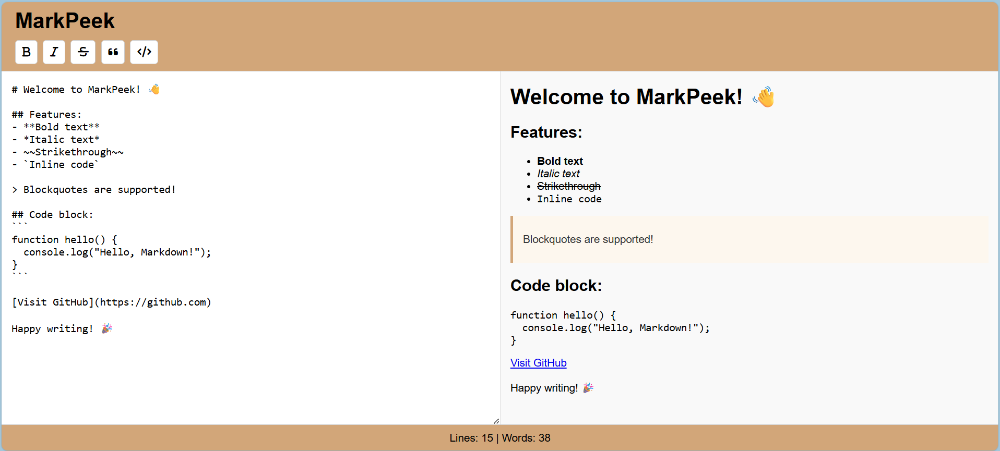

# 📝 MarkPeek - Live Markdown Editor

**MarkPeek** is a simple, responsive, and beginner-friendly **Markdown Previewer** that lets you write Markdown on the left and see live HTML rendering on the right — perfect for note-takers, bloggers, and developers.

> ⚡️ Built using just HTML, CSS, and vanilla JavaScript — no frameworks, no build tools!

---

## 🔍 Features

- 🖊️ Live Markdown → HTML preview
- 🧠 Format buttons: Bold, Italic, Strike, Quote, Inline Code
- 📜 Pre-filled sample content to guide first-time users
- 📱 Fully mobile responsive
- 🔢 Real-time word and line count in the footer
- 🎨 GitHub-style blockquote formatting
- 🔐 No login, no database — all in-browser

---

## 🚀 Demo

👉 [Click here to use it now](https://github.com/bablu2b/markpeek)  

  

---

## 🛠️ How to Use

1. Just open the site — it’s ready to go!
2. Type or paste Markdown into the **left pane**
3. See formatted HTML appear on the **right side instantly**
4. Use the formatting buttons (Bold, Italic, etc.) to quickly style text
5. Watch the **word and line count** update as you type!

---

## 📁 Project Structure

📦 markpeek/
├── index.html # Main page
├── style.css # Styles and layout
├── script.js # Markdown parsing + preview
├── formatting.js # Button formatting logic
└── README.md # This file

---

## 🤝 Why You Should Fork This

- 🔄 Simple structure — great for learning web basics
- 💡 Add your own features: dark mode, save as `.md`, print/export
- 🧩 No build tools — works with just a browser
- 📚 Perfect for portfolios and coding interviews

> **👨‍💻 Fork it. Use it. Customize it. Show it off.**

## 📜 License

MIT License — free to use, modify, and share.

---

## 🙌 Love it?

If this helped you or you learned something:
⭐️ **Star this repo**  
🔄 **Fork it and add your own twist!**